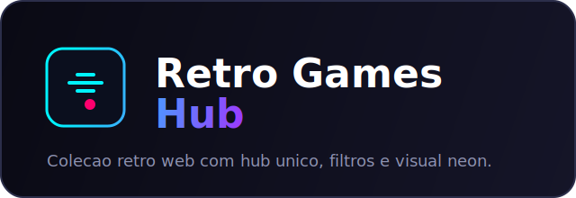

<div align="center">
  
  <h1>Retro Games Hub</h1>
  <p><i>Hub interativo de jogos clássicos com visual neon, navegação por categorias e execução 100% web estática</i></p>

  <p>
    
    
    
    
    
  </p>
</div>

---

## Preview

- Hub principal: [index.html](index.html)
- Identidade visual/logotipo: [docs/assets/retro-games-hub-logo.svg](docs/assets/retro-games-hub-logo.svg)

---

## Documentação Modular

A documentação foi organizada por domínio para facilitar onboarding, manutenção e evolução:

- [docs/README.md](docs/README.md)
- [docs/ARQUITETURA.md](docs/ARQUITETURA.md)
- [docs/CATALOGO_DE_JOGOS.md](docs/CATALOGO_DE_JOGOS.md)
- [docs/GUIA_GAME_UI_COMPONENTES.md](docs/GUIA_GAME_UI_COMPONENTES.md)
- [docs/OPERACAO_DEPLOY_MANUTENCAO.md](docs/OPERACAO_DEPLOY_MANUTENCAO.md)
- [docs/QUALIDADE_SEO_ACESSIBILIDADE.md](docs/QUALIDADE_SEO_ACESSIBILIDADE.md)
- [docs/TESTES_E_VALIDACAO.md](docs/TESTES_E_VALIDACAO.md)
- [docs/ROADMAP_TECNICO.md](docs/ROADMAP_TECNICO.md)
- [docs/HANDOFF_TECNICO.md](docs/HANDOFF_TECNICO.md)

---

## Visão Geral

O **Retro Games Hub** centraliza uma coleção de jogos retrô em uma única experiência web com foco em:

- acesso rápido a jogos clássicos em interface consistente;
- navegação por categorias, busca por nome e troca de visualização;
- execução local simples e deploy estático sem backend obrigatório.

---

## Principais Recursos

- **Hub central ARCGames** com home, destaques, recomendação do dia e atalhos por categoria.
- **Coleção com 12 jogos**: Asteroids, Blackjack, Breakout, Campo Minado, Damas, Xadrez, Flappy Bird, Memory Match 2.0, Pong 2.0, Snake 2.0, Space Invaders e Tetris.
- **Persistência local** via `localStorage` para perfil do jogador e high scores (quando aplicável).
- **Experiência visual neon** com animações de fundo em Canvas e UI responsiva.
- **Estrutura modular por jogo**, mantendo isolamento entre estilos, lógica e páginas de cada título.
- **Game UI compartilhada** com componentes reutilizáveis para páginas de jogos (`assets/css/game-ui.css`).

---

## Arquitetura

Fluxo principal da aplicação:

1. Usuário acessa `index.html` (hub).
2. O script inline da página controla estado de visualização (home, catálogo, perfil e configurações).
3. Busca/filtros ordenam cards de jogos sem recarregar a página.
4. Cada card navega para `games/<slug>/index.html`.
5. Cada jogo executa sua própria lógica (`script.js`) e renderização (Canvas/DOM), de forma isolada.
6. Preferências e recordes são armazenados localmente no navegador.

Detalhamento completo: [docs/ARQUITETURA.md](docs/ARQUITETURA.md).

---

## Performance

Estado atual (sem benchmark formal automatizado):

- projeto estático sem dependências de build em runtime;
- animações em `requestAnimationFrame` nos jogos e no hub;
- assets locais simples (HTML/CSS/JS) e carregamento direto;
- risco principal de performance concentrado em loops Canvas dos jogos.

Checklist técnico de otimização e próximos passos em: [docs/QUALIDADE_SEO_ACESSIBILIDADE.md](docs/QUALIDADE_SEO_ACESSIBILIDADE.md).

---

## Desafios Técnicos

- manter consistência visual entre jogos diferentes sem acoplamento excessivo;
- equilibrar efeitos neon/animações com legibilidade e fluidez em dispositivos modestos;
- evoluir SEO e acessibilidade em páginas estáticas distribuídas por múltiplas rotas;
- padronizar qualidade entre jogos com níveis distintos de complexidade.

---

## Roadmap

- padronização gradual de semântica, metadados e landmarks em todas as páginas;
- melhoria de acessibilidade por teclado e indicadores de foco;
- automações de validação (links, estrutura e auditorias básicas);
- refinamento mobile e redução de custo de renderização em Canvas.

Backlog técnico detalhado: [docs/ROADMAP_TECNICO.md](docs/ROADMAP_TECNICO.md).

---

## Resultado de Validação Estrutural

Resultado de referência da validação local:

- Data: `2026-03-29` (America/Sao_Paulo)
- Execução: `2026-03-29T02:05:05-03:00`
- Script: `./scripts/run_validation.sh`
- Artefatos:
  - `docs/reports/latest_validacao_report.md`
  - `docs/reports/latest_validacao_report.raw.log`

| Etapa | Status | Resultado |
| --- | --- | ---: |
| Validação de arquivos raiz | ok | 6/6 |
| Validação de arquivos por jogo | ok | 48/48 |

---

## Stack Tecnológica

- **Frontend**: HTML5, CSS3, JavaScript (ES6+)
- **Renderização**: Canvas 2D API
- **Persistência local**: Web Storage (`localStorage`)
- **Deploy**: GitHub Pages / qualquer hospedagem estática

---

## Estrutura do Projeto

```text
.
├── docs/
│   ├── assets/
│   │   └── retro-games-hub-logo.svg
│   ├── reports/
│   │   ├── latest_validacao_report.md
│   │   └── latest_validacao_report.raw.log
│   ├── ARQUITETURA.md
│   ├── CATALOGO_DE_JOGOS.md
│   ├── GUIA_GAME_UI_COMPONENTES.md
│   ├── HANDOFF_TECNICO.md
│   ├── OPERACAO_DEPLOY_MANUTENCAO.md
│   ├── QUALIDADE_SEO_ACESSIBILIDADE.md
│   ├── README.md
│   ├── ROADMAP_TECNICO.md
│   ├── templates/
│   │   └── game-ui-index-template.html
│   └── TESTES_E_VALIDACAO.md
├── scripts/
│   ├── run_validation.sh
│   └── sync-games-catalog.sh
├── assets/
│   ├── css/
│   │   ├── global.css
│   │   ├── game-ui.css
│   │   └── hub.css
│   ├── data/
│   │   └── games-catalog.json
│   └── js/
│       └── hub-intro.js
├── games/
│   ├── asteroids/
│   ├── blackjack/
│   ├── breakout/
│   ├── campo-minado/
│   ├── checkers/
│   ├── chess/
│   ├── flappy-bird/
│   ├── memory-match-2/
│   ├── pong-2/
│   ├── snake-2/
│   ├── space-invaders/
│   └── tetris/
├── .nojekyll
├── index.html
└── README.md
```

---

## Como Rodar Localmente

### Pré-requisitos

- Navegador moderno (Chrome, Edge, Firefox ou Safari)
- Opcional: Python 3 para servidor local

### Execução

```bash
git clone https://github.com/NullCipherr/Retro-Games-Hub.git
cd Retro-Games-Hub
python3 -m http.server 3000
```

Acesse: `http://localhost:3000`

---

## Deploy

### GitHub Pages

1. Suba o projeto na branch de publicação (ex.: `main`).
2. Configure o Pages para publicar a raiz do repositório.
3. Garanta que `.nojekyll` permaneça versionado.

### Hosts estáticos alternativos

- Netlify, Vercel (modo estático) ou Cloudflare Pages funcionam sem adaptação estrutural.

Guia operacional completo: [docs/OPERACAO_DEPLOY_MANUTENCAO.md](docs/OPERACAO_DEPLOY_MANUTENCAO.md).

---

## Scripts Principais

- `./scripts/sync-games-catalog.sh`: varre `games/*` e atualiza `assets/data/games-catalog.json`.
- `./scripts/run_validation.sh`: valida estrutura mínima do hub e dos jogos, gerando relatório em `docs/reports`.

---

## Adicionar Novo Jogo (Mínimo de Configuração)

Fluxo recomendado:

1. Crie a pasta do jogo em `games/<novo-jogo>/`.
2. Adicione ao menos os arquivos base:
   - `index.html`
   - `docs.html`
   - `script.js`
   - `style.css`
3. Para acelerar, use o template de interface padrão:
   - `docs/templates/game-ui-index-template.html`
   - Guia: `docs/GUIA_GAME_UI_COMPONENTES.md`
4. Execute:
   ```bash
   ./scripts/sync-games-catalog.sh
   ```
5. Abra o hub: o jogo já aparece automaticamente na home, no catálogo, nas categorias e nos contadores.

Observação: você não precisa editar cards manualmente no `index.html`.

---

## Licença

Este repositório **ainda não possui um arquivo de licença explícito**.

Recomendação: definir a licença antes de uso comercial/distribuição pública para evitar ambiguidades jurídicas.

---

<div align="center">
  <p>Desenvolvido por <a href="https://github.com/NullCipherr">NullCipherr</a></p>
</div>
